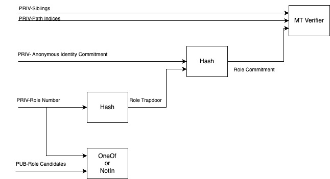

# zkrole
ユーザーに秘密のroleを割り当てることができるzkpアプリケーションです。
roleの割り当ては、smart contractに予め登録されたAuthority addressまたは、smart contractによるロジックで行うことができます。秘匿groupのzkpアプリケーションであるsemaphoreと組み合わせて使うことを想定しています。semaphoreでも複数のgroupをroleとして使うことができますが、groupに誰かが登録されたことを隠したり、groupに属していないことの証明をすることはできません。zkroleでは秘匿role登録や、柔軟なroleの属性証明が可能です。
詳しくは次の節で説明します。

# semaphoreとの比較

Semaphoreは、次のタスクの実行が可能です。

1. ユーザーはidentity commitmentを公開してgroupに入ることができる。
2. groupのメンバーは、identity commitmentを明かさずにgroupに属していることの証明ができる。

Semaphoreでは、次のタスクはできません。

1. groupにメンバーが追加されたことを秘匿にする。
2. groupに所属していないことの証明

どちらも、zkroleでは可能です。

# 仕組み
Smart contractは次の図ようにユーザーのidentity commitmentとrole numberのhashをMerkle treeにcommitします。

Circomは次の図ようにユーザーのidentity trapdoorとrole number, Merkle proofをprivate inputとし、role numberがcandidateに含まれるまたは含まれないことの証明ができます。

