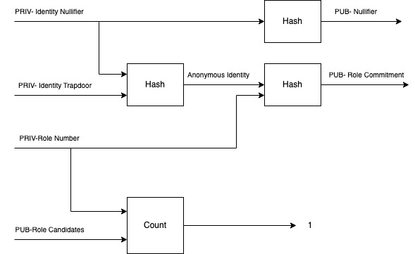
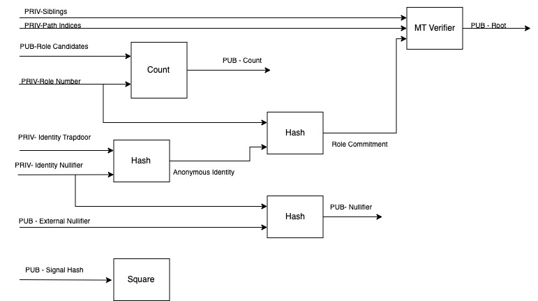

# zkrole

ユーザーに秘密の role を割り当てることができる zkp アプリケーションです。
role の割り当ては、smart contract に予め登録された Authority address または、smart contract によるロジックで行うことができます。秘匿 group の zkp アプリケーションである semaphore と組み合わせて使うことを想定しています。semaphore でも複数の group を role として使うことができますが、group に誰かが登録されたことを隠したり、group に属していないことの証明をすることはできません。zkrole では秘匿 role 登録や、柔軟な role の属性証明が可能です。
詳しくは次の節で説明します。

# semaphore との比較

Semaphore は、次のタスクの実行が可能です。

1. ユーザーは identity commitment を公開して group に入ることができる。
2. group のメンバーは、identity commitment を明かさずに group に属していることの証明ができる。

Semaphore では、次のタスクはできません。

1. group にメンバーが追加されたことを秘匿にする。
2. group に所属していないことの証明

どちらも、zkrole では可能です。

# 仕組み

Smart contract は次の図ようにユーザーの identity commitment と role number の hash を Merkle tree に commit します。

またそのときに次のような proof を提出します。

Circom は次の図ようにユーザーの identity trapdoor と role number, Merkle proof を private input とし、role number が candidate に含まれるまたは含まれないことの証明ができます。

